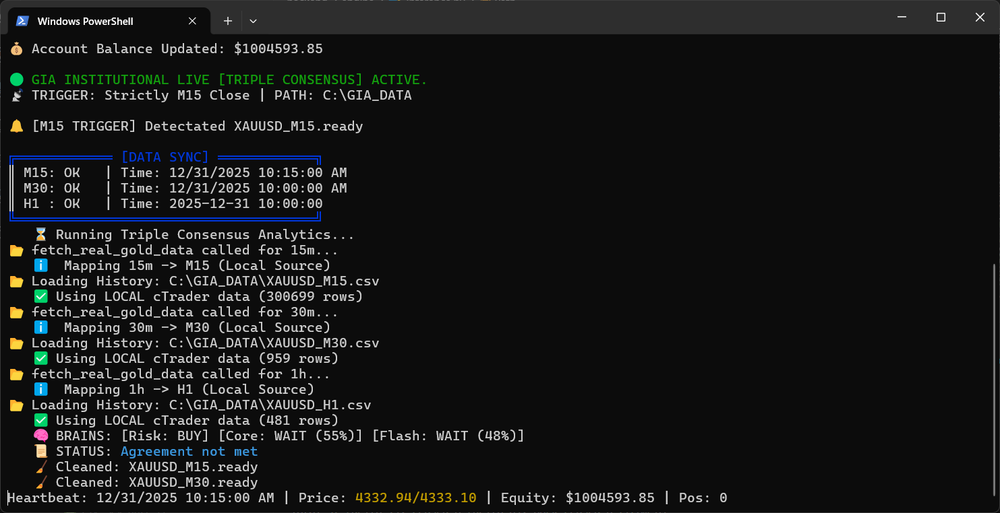

<div align="center">

# 🦁 GIA - Gold Intelligence Agent 
### *Institutional Intelligence Framework for XAUUSD Trading*

[](https://www.python.org/)
[](https://xgboost.ai/)
[](https://spotware.com/)
[](https://scikit-learn.org/)
[](https://pandas.pydata.org/)
[](https://numpy.org/)
[](LICENSE)

---



</div>

<div dir="rtl">

## 📋 نظرة عامة
**Gold Intelligence Agent (GIA)** هي بيئة تطويرية متكاملة لتعليم وتطوير خوارزميات الذكاء الاصطناعي المتخصصة في تحليل وتداول الذهب (XAUUSD). تم تصميم هذا المشروع ليكون مختبراً للمطورين والباحثين في مجالات الـ Quantitative Finance والـ Machine Learning.

> **💡 ملاحظة هامة:** هذا المستودع يحتوي على **الإطار البرمجي العام** وأدوات التدريب، ولا يحتوي على نماذج (Models) جاهزة للتداول المباشر، وذلك تشجيعاً للمستخدمين على بناء وتطوير نماذجهم الخاصة.

---

## 🎯 الأهداف التعليمية للمشروع

- 🧬 **هندسة الخصائص المالية:** تعلم كيفية استخراج أكثر من 30 مؤشر فني متقدم من بيانات الذهب الخام.
- 🧠 **أنظمة الإجماع (Consensus Systems):** فهم كيفية بناء نظام اتخاذ قرار يعتمد على "تصويت" عدة نماذج ذكاء اصطناعي (Multi-Agent).
- ⚖️ **الاختبار التاريخي الصارم (Backtesting):** كيفية محاكاة تداول حقيقي يأخذ في الاعتبار قوانين الوساطة (Spread, Slippage, Margin).
- 📡 **التكامل مع الأسواق الحية:** فهم آلية ربط نماذج ML بتدفقات البيانات الحيز عبر عائلات الـ WebSockets و API.

---

## 🏗️ البنية التحتية للتطوير

### 📂 مجلد التدريب (Training Pipeline)
يحتوي مجلد `backend/training/` على سكربتات التدريب المتقدمة. يمكنك استخدامها لتدريب نماذجك الخاصة باستخدام تقنيات مثل:
*   🚀 **XGBoost Reinforcement:** لتدريب الموديل على اقتناص أفضل نقاط الدخول.
*   🧬 **Evolutionary Algorithms:** لتطوير معايير اختيار الموديلات الأنجح برمجياً.

### 🧪 مختبر الاختبار (Battle Arena)
عبر ملف `run_backtest.py` يمكن للمطورين اختبار جودة خوارزمياتهم على بيانات تاريخية تمتد لأكثر من 20 عاماً، والحصول على تقارير مؤسساتية تشمل:
- **Profit Factor**
- **Sharpe Ratio**
- **Max Drawdown**

---

## 🛠️ التقنيات المستخدمة (Tech Stack)

*   🐍 **Python 3.9+** - اللغة الأساسية للمشروع.
*   🤖 **XGBoost** - محرك الذكاء الاصطناعي الرئيسي.
*   📊 **Pandas & NumPy** - لمعالجة مجموعات البيانات الضخمة.
*   🌐 **Twisted & WebSocket** - لربط البيانات الحية مع OpenAPI.
*   🎨 **Colorama** - لواجهة أوامر احترافية.

---

## ⚡ البدء السريع (Quick Start)

1.  **تجهيز البيئة:**
    ```bash
    pip install -r requirements.txt
    ```
2.  **تدريب أول نموذج لك:**
    يمكنك البدء بتعديل وتدريب النماذج الموجودة في `backend/training/` لتوليد ملفات `.pkl` في مجلد الموديلات.
3.  **محاكاة السوق:**
    بمجرد توليد الموديلات، استخدم `run_backtest.py` لرؤية النتائج.

---

## 📜 عقد المسؤولية التعليمي
هذا المشروع مخصص للأغراض **التعليمية والبحثية فقط**. تداول الذهب ينطوي على مخاطر عالية، والهدف من هذا الإطار هو توفير الأدوات التقنية لفهم كيفية عمل الذكاء الاصطناعي في الأسواق المالية، وليس تقديم نصائح استثمارية أو أدوات ربح جاهزة.

---

<div align="center">

**GIA - Gold Intelligence Agent. Empowering the Next Generation of AI Traders.**
بني بشغف لتطوير مجتمع التداول الخوارزمي العربي.

</div>

</div>
